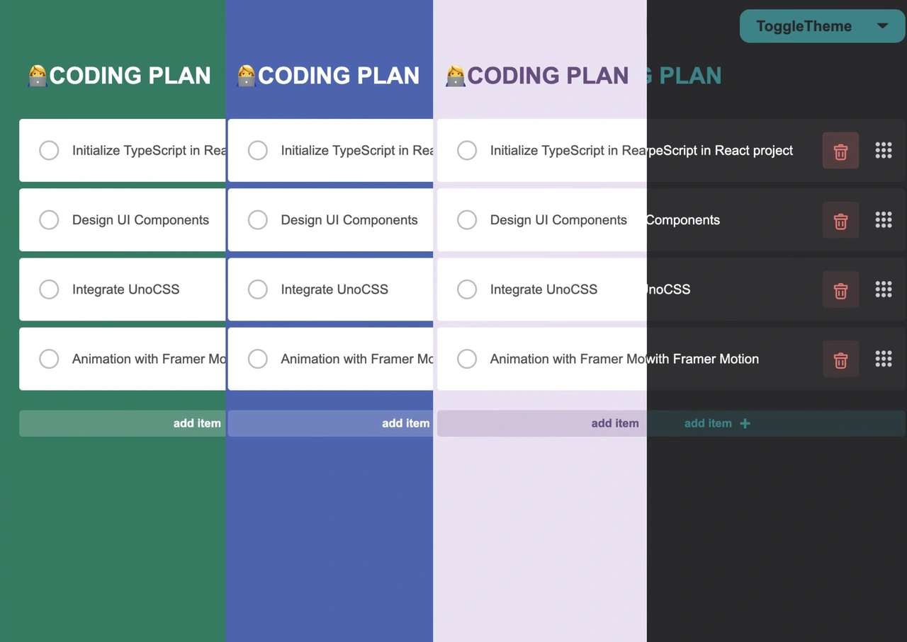
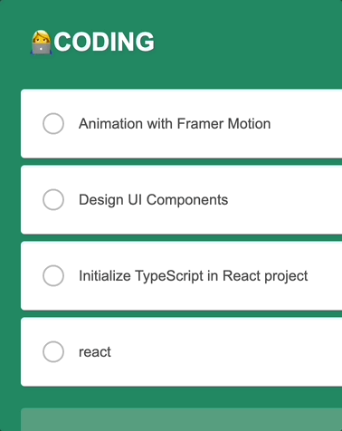
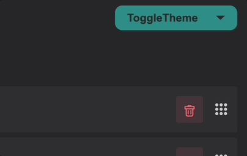

# React TodoList



# Features

1. Theme Customization
2. CRUD Operations

# Animation





## Stack

- React
- Typescript
- Vite
- Unocss
- Framer-motion

## demo

<a href="https://fizztodolist.vercel.app">demo</a>

## Run in dev

```
pnpm install
pnpm dev
```
